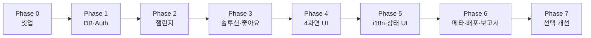

# CanAIThis 개발 Phase

> 기준: [기획서.md](./기획서.md) · 제출 기한 **2026-06-15**  
> 오늘 기준 약 2주 — **Phase 0~6 = 제출용 MVP**, **Phase 7 = 여유 시**

---

## 전체 흐름



| Phase | 목표 | 예상 일수 | PDF 요구 충족 |
|-------|------|-----------|---------------|
| 0 | Next.js 16 프로젝트 골격 | 0.5일 | 3.1 환경 |
| 1 | Prisma + PostgreSQL + Auth.js | 1~2일 | 3.3·3.4·3.5 |
| 2 | 챌린지 Create/Read/Delete | 1~2일 | 3.3·3.6 일부 |
| 3 | 솔루션 + 좋아요 | 1~2일 | 3.3·3.5 |
| 4 | 4화면 + 레이아웃 + shadcn | 2일 | 3.6·3.8 |
| 5 | i18n + loading/error/not-found | 1~2일 | 3.1·3.7 |
| 6 | 메타·sitemap·Vercel·보고서 | 1~2일 | 3.9·3.10·제출물 |
| 7 | 검색·수정·모달 (선택) | 여유 시 | — |

---

## Phase 0 — 프로젝트 셋업 (0.5일)

**목표:** 빌드·린트·폴더 구조가 고정되고, 이후 Phase에서 기능만 얹을 수 있는 상태.

### 할 일

- [ ] `npx create-next-app@latest` — App Router, TypeScript, Tailwind, ESLint, **Turbopack**
- [ ] shadcn/ui 초기화 (`Button`, `Card`, `Input`, `Textarea`, `Select`, `Avatar`, `DropdownMenu`)
- [ ] 폴더 규칙 정하기 (예시)
  ```
  app/
    [locale]/          # next-intl 경로 또는 (locale) 그룹
      page.tsx         # /
      challenges/
        new/page.tsx
        [id]/page.tsx
      profile/page.tsx
    api/auth/[...nextauth]/route.ts
  components/
  lib/                 # prisma, auth, validations
  actions/             # Server Actions
  messages/            # ko.json, en.json
  ```
- [ ] `.env.example` — `DATABASE_URL`, `AUTH_SECRET`, `GITHUB_ID`, `GITHUB_SECRET`, `GOOGLE_ID`, `GOOGLE_SECRET`
- [ ] README에 로컬 실행 방법 3줄

### 완료 기준

- `npm run dev` / `npm run build` 성공
- 빈 레이아웃 + 헤더(로고, 언어 전환 placeholder, 로그인 버튼 placeholder)만 보임

---

## Phase 1 — DB + 인증 (1~2일)

**목표:** GitHub 또는 Google 로그인 후 `session.user.id`로 Prisma 쿼리 가능. 보호 라우트 동작.

### 할 일

- [ ] Neon 또는 Supabase에 PostgreSQL 생성 → `DATABASE_URL`
- [ ] Prisma 스키마 (기획서 ER 그대로)
  - `User`, `Challenge`, `Solution`, `Like`
  - `Like`: `@@unique([solutionId, userId])` — 중복 좋아요 방지
- [ ] `npx prisma migrate dev` + seed는 **필수 아님** (실제 OAuth 사용자로 채움)
- [ ] Auth.js v5 — **GitHub + Google** Provider (`providers: [GitHub, Google]`)
- [ ] Prisma Adapter로 User 동기화 (provider마다 `Account` 레코드, 동일 이메일이면 `allowDangerousEmailAccountLinking` 여부는 **기본 off** — 계정 연동 정책 문서화)
- [ ] 로그인 UI: “GitHub로 계속” / “Google로 계속” 두 버튼 (`signIn("github")`, `signIn("google")`)
- [ ] `auth.ts` + `middleware.ts` — `/challenges/new`, `/profile` **서버/미들웨어 차단**
- [ ] 헤더: 로그인 / 로그아웃 / 프로필 아바타 (`next/image`)

### Server Action / API (이 Phase)

| 액션 | 용도 |
|------|------|
| (없어도 됨) | Auth는 Route Handler `api/auth/[...nextauth]` |

### 완료 기준

- [ ] 비로그인 → `/challenges/new` 접근 시 로그인 유도
- [ ] GitHub·Google 각각 로그인 → DB `User` + `Account` 생성 확인
- [ ] **PDF 3.4** 보호 영역 1개 이상 동작

### Auth.js 참고 (`auth.ts`)

```ts
import NextAuth from "next-auth";
import GitHub from "next-auth/providers/github";
import Google from "next-auth/providers/google";
import { PrismaAdapter } from "@auth/prisma-adapter";
import { prisma } from "@/lib/prisma";

export const { handlers, auth, signIn, signOut } = NextAuth({
  adapter: PrismaAdapter(prisma),
  providers: [
    GitHub({
      clientId: process.env.GITHUB_ID,
      clientSecret: process.env.GITHUB_SECRET,
    }),
    Google({
      clientId: process.env.GOOGLE_ID,
      clientSecret: process.env.GOOGLE_SECRET,
    }),
  ],
  session: { strategy: "database" }, // Adapter 사용 시
});
```

`.env.example` 추가 항목:

```env
GOOGLE_ID=
GOOGLE_SECRET=
```

Google Cloud Console → **API 및 서비스 → 사용자 인증 정보 → OAuth 2.0 클라이언트 ID (웹)**:

| 환경 | 승인된 리디렉션 URI |
|------|---------------------|
| 로컬 | `http://localhost:3000/api/auth/callback/google` |
| Vercel | `https://<프로덕션-도메인>/api/auth/callback/google` |

GitHub OAuth App에도 동일하게 `.../api/auth/callback/github` 등록.

---

## Phase 2 — 챌린지 CRUD (1~2일)

**목표:** 홈 피드 + 챌린지 작성 + 상세(본문만) + 본인 삭제.

### 할 일

- [ ] Zod 스키마: `title`, `description`, `category`, `imageUrl`(optional)
- [ ] Server Actions
  - `createChallenge`
  - `deleteChallenge` (authorId 검증)
- [ ] **`/`** — 챌린지 카드 목록 (최신순), 카테고리 필터(쿼리 `?category=`)
- [ ] **`/challenges/new`** — react-hook-form + zod, 로그인 필수
- [ ] **`/challenges/[id]`** — 챌린지 본문만 (솔루션 목록은 Phase 3)
- [ ] 챌린지 이미지: URL 입력 또는 업로드는 **MVP에서 URL만** 해도 됨 → `next/image` 적용

### 완료 기준

- [ ] 로그인 사용자가 챌린지 작성 → 홈·상세에 노출
- [ ] **PDF 3.3** Challenge **Create** 동작
- [ ] 마이페이지 없이도 상세 URL로 Read 가능

---

## Phase 3 — 솔루션 + 좋아요 (1~2일)

**목표:** 챌린지 상세가 “질문 + 답 목록”으로 완성. 좋아요로 정렬.

### 할 일

- [ ] Zod: `content`, `githubUrl`, `demoUrl`, `challengeId`
- [ ] Server Actions
  - `createSolution` (로그인 + challenge 존재 검증)
  - `toggleLike` (Create/Delete, unique 제약)
  - `deleteSolution` (authorId 검증)
- [ ] **`/challenges/[id]`** — 솔루션 목록, **좋아요 수 내림차순** 정렬
- [ ] 솔루션 작성 폼 (상세 페이지 하단 또는 사이드) — GitHub·데모 URL 필수 유도
- [ ] 좋아요 버튼: 로그인 시만, 비로그인 시 로그인 안내

### 완료 기준

- [ ] Solution **Create** + Like **Create/Delete** (토글)
- [ ] 같은 사용자가 두 번 좋아요 불가
- [ ] **PDF 3.3** 쓰기 2종 이상 (Challenge + Solution/Like)

---

## Phase 4 — 4화면 UI 완성 (2일)

**목표:** 기획서 4화면 + 네비게이션 + 프로필 삭제까지 연결.

### 화면 체크리스트

| # | 경로 | Phase에서 완료할 것 |
|---|------|---------------------|
| 1 | `/` | 검색(`?q=`), 카테고리, 카드 → 상세 링크 |
| 2 | `/challenges/[id]` | 본문 + 솔루션 + 좋아요 + 솔루션 작성 |
| 3 | `/challenges/new` | 챌린지 폼 |
| 4 | `/profile` | 내 챌린지/솔루션 탭, 삭제 버튼 |

### 할 일

- [ ] 공통 `Header` / `Footer`
- [ ] 홈 검색: title/description `contains` (Prisma)
- [ ] `/profile` — Challenge·Solution 목록, `deleteChallenge` / `deleteSolution` 연결
- [ ] empty state (“아직 챌린지가 없어요” 등) — i18n 키만 넣어두고 Phase 5에서 문구 채움
- [ ] 반응형: 모바일 1열, 데스크톱 그리드

### 완료 기준

- [ ] **PDF 3.6** 서비스 화면 4개 (로그인/회원가입 제외)
- [ ] **PDF 3.8** `next/image` 최소 2곳 (프로필, 챌린지)

---

## Phase 5 — i18n + 로딩/에러 UI (1~2일)

**목표:** 한/영 전환 + 과제 필수 UX 파일.

### 할 일

- [ ] `next-intl` — `[locale]` 라우트 또는 middleware locale
- [ ] **쿠키 기반** 언어 전환 (기획서와 동일)
- [ ] `messages/ko.json`, `messages/en.json` — 네비, 폼 라벨, 버튼, empty/error 문구
- [x] `app/loading.tsx` (전역)
- [x] `challenges/[id]/loading.tsx`, `profile/loading.tsx` (페이지별)
- [x] `error.tsx` (전역 + `challenges/error.tsx`)
- [ ] `not-found.tsx` + 존재하지 않는 `[id]` 시 `notFound()`
- [ ] Server Action 실패 시 `useFormState` 또는 toast로 메시지

### 완료 기준

- [ ] 쿠키/버튼으로 KO ↔ EN 전환 시 UI 문구 변경
- [ ] **PDF 3.1** · **PDF 3.7** 충족

---

## Phase 6 — 메타데이터 + 배포 + 제출 (1~2일)

**목표:** Vercel URL 고정 + 제출물 준비.

### 할 일

- [ ] `metadata` / `generateMetadata` — title, description, OG
- [ ] `app/icon.tsx` 또는 `favicon.ico`
- [ ] `app/sitemap.ts`, `app/robots.ts`
- [ ] Vercel 연결: env 변수 Production에 등록
- [ ] Production DB migrate (`prisma migrate deploy`)
- [ ] 제출용 `.env` — **채점용 임시 키**로 교체 (기획서 8장)
- [ ] 보고서 PDF: 개요, 아키텍처, 스크린샷, URL, 테스트 계정 안내
- [ ] 압축: `node_modules`, `.next` 제외

### 제출 전 체크리스트 (PDF 5장)

- [ ] Next.js 16 + App Router + TS
- [ ] 한/영 i18n
- [ ] DB 쓰기 C/U/D (Challenge, Solution, Like, Delete)
- [ ] OAuth + 보호 라우트
- [ ] Server Action 1개 이상 ✓ (여러 개 권장)
- [ ] 화면 4개
- [ ] loading / error / not-found
- [ ] next/image
- [ ] metadata, favicon, OG, sitemap.xml, robots.txt
- [ ] 배포 URL 살아 있음

---

## Phase 7 — 선택 개선 (여유 시)

기획서 Phase 2와 동일.

- [x] 검색: 정렬(최신/인기) — `?sort=latest|popular` (인기 = 솔루션 수)
- [ ] 태그·카테고리 고도화 (선택)
- [x] 솔루션 **Update** (작성자만)
- [x] Parallel + Intercepting Routes로 솔루션 작성·수정 **모달** (화면 수는 여전히 4개로 카운트)

---

## 권장 작업 순서 (한 줄 요약)

1. **뼈대** (Phase 0) → 2. **로그인·DB** (1) → 3. **챌린지** (2) → 4. **답·좋아요** (3)  
5. **프로필·검색·UI** (4) → 6. **번역·로딩** (5) → 7. **배포·문서** (6)

인증 없이 UI만 먼저 만들지 말 것 — Server Action·authorId 검증이 전부 `session`에 묶이므로 **Phase 1 직후 Phase 2**가 가장 빠름.

---

## Phase별 “데모 가능” 상태

| 시점 | 데모 시나리오 |
|------|----------------|
| Phase 1 끝 | GitHub·Google 로그인 |
| Phase 2 끝 | 챌린지 올리고 홈에서 보기 |
| Phase 3 끝 | 답 달고 좋아요로 순서 바뀜 |
| Phase 4 끝 | 프로필에서 삭제까지 E2E |
| Phase 5 끝 | 영문 전환 + 로딩 스켈레톤 |
| Phase 6 끝 | 제출 URL로 채점 가능 |

---

## 다음 액션

지금 워크스페이스에는 코드가 없으므로, 바로 시작한다면:

```bash
# Phase 0 시작
npx create-next-app@latest canaithis-app --typescript --tailwind --eslint --app --turbopack
```

원하면 **Phase 0부터 순서대로 구현**해 줄 수 있다. 어느 Phase부터 할지 알려주면 된다.