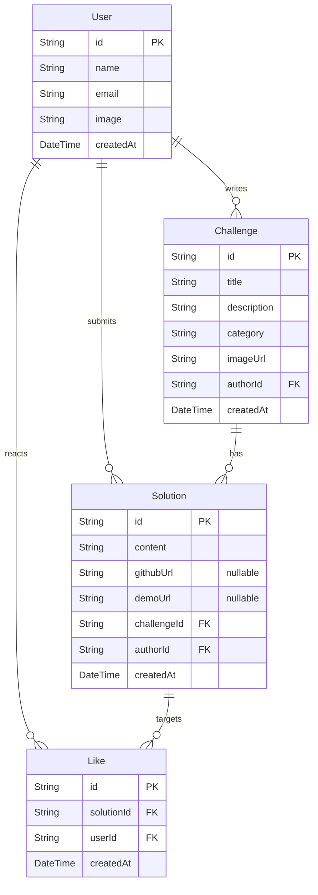

# CanAIThis 기획서

> 기말 개별 프로젝트 (Next.js 16 + App Router + TypeScript)
> 작성일 2026-05-28

---

## 1. 개요

| 항목 | 내용 |
|---|---|
| 서비스명 | CanAIThis |
| 한 줄 설명 | "AI로 이거 해봤다 / 이거 되나?" 사례를 올리고 답하는 게시판형 커뮤니티 |
| 형태 | 개인 프로젝트 (1인) |
| 제출 기한 | 2026-06-15 |
| 핵심 기술 | Next.js 16 (App Router) · TypeScript · Prisma · PostgreSQL · Auth.js |

---

## 2. 무엇을 만드는가

사용자가 두 가지 형태의 글을 올린다.

- **챌린지** — "이거 AI로 되나?" 형식의 질문 (예: "테이크 여러 개를 주면 알아서 컷 편집까지 해주는 거 가능?")
- **솔루션** — 챌린지에 대한 답. 직접 성공한 방법, 실패한 시도, 확인 결과를 자유롭게 올린다. GitHub 링크와 데모 URL은 있으면 신뢰도를 높이는 선택 자료로 붙인다.

다른 사용자는 솔루션에 **좋아요**를 눌러 쓸 만한 답을 위로 띄운다.

서비스 자체는 LLM/에이전트를 호출하지 않는다. 콘텐츠는 전적으로 사용자가 만든다.

---

## 3. 화면 구성

총 4개 화면 (로그인/회원가입 화면 제외).

| # | 경로 | 역할 | 보호 |
|---|---|---|---|
| 1 | `/` | 홈/피드. 챌린지 카드 목록 + 검색 + 카테고리 필터 | - |
| 2 | `/challenges/[id]` | 챌린지 본문 + 솔루션 목록. **솔루션 Create / 좋아요 Update** 발생 | 쓰기는 로그인 필요 |
| 3 | `/challenges/new` | 챌린지 작성 폼. **챌린지 Create** 발생 | 로그인 필수 |
| 4 | `/profile` | 내가 올린 챌린지/솔루션, 삭제 | 로그인 필수 |

---

## 4. 데이터 모델

**DB 쓰기 동작 (PDF 3.3 충족)**
- Challenge Create (챌린지 작성)
- Solution Create (솔루션 제출)
- Like Create / Delete (좋아요 토글, 중복 방지)
- Challenge / Solution Delete (마이페이지에서 본인 글 삭제)

---

## 5. 기술 스택

| 영역 | 선택 |
|---|---|
| 프레임워크 | Next.js 16 (App Router) — Turbopack 기본 |
| 언어 | TypeScript |
| ORM / DB | Prisma + PostgreSQL (Neon 또는 Supabase 무료 티어) |
| 인증 | Auth.js (NextAuth v5) — **GitHub + Google** OAuth |
| i18n | next-intl, 한국어/영어 |
| 스타일링 | Tailwind CSS + shadcn/ui |
| 폼 검증 | react-hook-form + zod |
| 배포 | Vercel |

서버 로직은 **Server Actions** 우선으로 작성한다 (챌린지 작성, 솔루션 제출, 좋아요, 삭제).

### 인증 (GitHub + Google)

- Auth.js에 `GitHub`, `Google` provider 두 개 등록.
- Prisma Adapter: 로그인 시 `User` 1명 + provider별 `Account` (같은 사람이 두 provider로 로그인하면 `Account` 2개, `userId`는 각각 별도 `User` — **이메일 자동 병합은 기본 비활성**).
- UI: 헤더에 로그인 드롭다운 또는 모달에서 provider 선택 버튼 2개.

---

## 6. 필수 요구사항 충족 매핑

PDF 체크리스트 기준.

| 요구사항 | 충족 위치 |
|---|---|
| Next.js 16 + App Router + TS | 프로젝트 기본 설정 |
| i18n (한/영) | next-intl, 쿠키 기반 전환 |
| DB 쓰기 1종 이상 | Challenge / Solution / Like — 모두 Create + 일부 Delete |
| 로그인 + 보호 영역 | Auth.js OAuth (GitHub·Google), `/challenges/new` · `/profile` 보호 |
| Route Handler 또는 Server Action | Server Action 다수 (글/좋아요/삭제) |
| 화면 3개 이상 | 4개 (`/`, `/challenges/[id]`, `/challenges/new`, `/profile`) |
| loading / error / not-found | 전역 + 페이지별 |
| 이미지 최적화 | next/image (챌린지 첨부, 프로필) |
| 메타데이터 | title/description, favicon, OG, sitemap.xml, robots.txt |
| 배포 | Vercel, 성적 확정까지 유지 |

---

## 7. 일정

**Phase 1 — 제출용 MVP (6/15 까지)**
- GitHub · Google OAuth (동일 `User` — Prisma Adapter가 provider별 `Account`로 연결)
- Challenge / Solution CRUD (최소 Create + Read)
- 좋아요 토글
- 4개 화면 + loading/error/not-found
- i18n 한/영
- Vercel 배포

**Phase 2 — 여유 있으면**
- 검색 개선 (카테고리, 정렬)
- 솔루션 수정
- 모달 형태 솔루션 작성 (Parallel/Intercepting Routes)

---

## 8. 유의 사항

- `.env`의 OAuth 시크릿(`GITHUB_*`, `GOOGLE_*`)·DB 비밀번호는 제출 시 채점용 임시 키로 교체.
- Google Cloud Console: OAuth 클라이언트(Web) 생성 → 승인된 리디렉션 URI에 `https://<도메인>/api/auth/callback/google` 및 로컬 `http://localhost:3000/api/auth/callback/google` 등록.
- AI 도구로 작성한 설계/구현 문서는 본 기획서를 포함해 함께 제출.
- 모든 코드는 제출자가 직접 설명할 수 있는 수준까지 이해한 상태로 제출.
