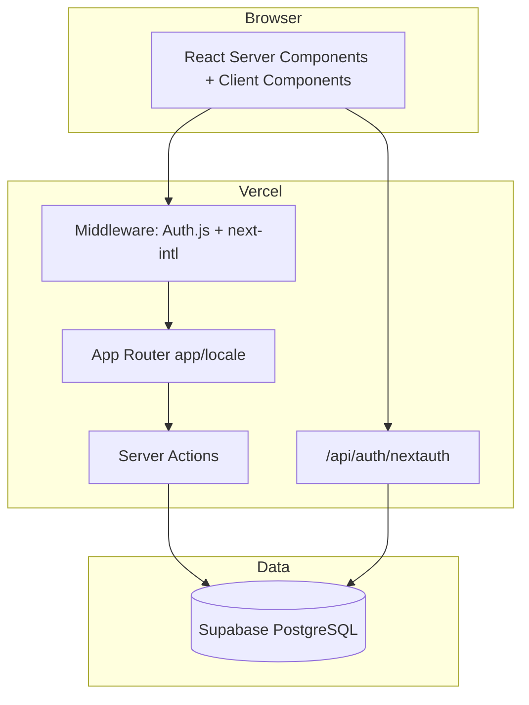

# CanAIThis — 기말 개별 프로젝트 제출 보고서

| 항목 | 내용 |
|------|------|
| 서비스명 | CanAIThis |
| 제출자 | (학번·이름 기입) |
| 작성일 | 2026-06-02 |
| 프로덕션 URL | https://canaithis.vercel.app |
| GitHub | https://github.com/tumblecat44/canaithis |
| DB | Supabase PostgreSQL (ap-northeast-2) |

---

## 1. 서비스 개요

**CanAIThis**는 “AI로 이거 해봤다 / 이거 되나?” 형식의 **챌린지(질문)**와 **솔루션(답변·선택 링크)**을 올리고, **좋아요**로 유용한 답을 위로 올리는 커뮤니티입니다. 솔루션은 별도 댓글이 아니라 사용자가 자유롭게 남기는 답변 단위입니다. 서비스 자체는 LLM API를 호출하지 않으며, 콘텐츠는 사용자가 작성합니다.

### 핵심 사용자 시나리오

1. 비회원: 홈 피드 열람, 챌린지 상세·솔루션 목록 조회
2. 회원(GitHub/Google OAuth): 챌린지 작성, 솔루션 작성, 좋아요, 마이페이지에서 본인 글 삭제
3. 언어: 헤더에서 KO/EN 전환(쿠키 `NEXT_LOCALE`)

---

## 2. 기술 스택

| 영역 | 선택 |
|------|------|
| 프레임워크 | Next.js 16.2 (App Router, TypeScript, Turbopack) |
| UI | Tailwind CSS 4, shadcn/ui |
| DB | PostgreSQL (Supabase), Prisma 7 |
| 인증 | Auth.js v5, Prisma Adapter, database session |
| OAuth | GitHub + Google |
| i18n | next-intl (`localePrefix: never`, `app/[locale]` 내부 라우팅) |
| 배포 | Vercel |
| 검증 | Zod + react-hook-form, Server Actions |

---

## 3. 아키텍처

### 디렉터리 요약

- `app/[locale]/` — 4개 화면 + intercepting modal (`@modal`)
- `actions/` — `createChallenge`, `deleteChallenge`, `createSolution`, `updateSolution`, `deleteSolution`, `toggleLike`
- `lib/queries/` — Prisma 읽기 전용 쿼리
- `messages/ko.json`, `en.json` — UI 문구
- `prisma/schema.prisma` — User, Account, Session, Challenge, Solution, Like

---

## 4. 화면 및 PDF 요구사항 대응

| # | 경로 | 기능 | PDF 항목 |
|---|------|------|----------|
| 1 | `/` | 챌린지 피드, `?q=` 검색, `?category=`, `?sort=latest\|popular` | 3.6 화면 1 |
| 2 | `/challenges/[id]` | 본문, 솔루션(좋아요순), 작성 폼, 모달 라우트 | 3.6 화면 2 |
| 3 | `/challenges/new` | 챌린지 작성(로그인 필수) | 3.6 화면 3 |
| 4 | `/profile` | 내 챌린지/솔루션 탭, 삭제 | 3.6 화면 4 |
| - | `/login` | GitHub·Google 로그인 | (과제: 로그인 화면 제외 카운트) |

**보호 라우트:** `/challenges/new`, `/profile`, 솔루션 작성·수정 — 미들웨어에서 `/login?callbackUrl=...`로 307 리다이렉트.

**UX 파일:** `loading.tsx`(전역·상세·프로필), `error.tsx`, `not-found.tsx`.

**이미지:** `next/image` — 프로필 아바타, 챌린지 첨부 URL.

**메타:** `generateMetadata`, `app/icon.tsx`, `robots.ts`, `sitemap.ts`.

---

## 5. DB 쓰기 (PDF 3.3)

| 엔티티 | Create | Update | Delete |
|--------|--------|--------|--------|
| Challenge | ✅ `createChallenge` | - | ✅ `deleteChallenge` (작성자) |
| Solution | ✅ `createSolution` | ✅ `updateSolution` (작성자) | ✅ `deleteSolution` |
| Like | ✅ `toggleLike` (토글) | - | ✅ 동일 액션으로 삭제 |

`Like`는 `@@unique([solutionId, userId])`로 중복 방지.

---

## 6. 인증

- **Provider:** GitHub, Google (`auth.config.ts`)
- **세션:** database strategy + Prisma Adapter
- **콜백 URL (프로덕션):**
  - `https://canaithis.vercel.app/api/auth/callback/github`
  - `https://canaithis.vercel.app/api/auth/callback/google`
- **로컬:** `http://localhost:3000/api/auth/callback/...`

---

## 7. 배포·운영

| 항목 | 값 |
|------|-----|
| Vercel 프로젝트 | canaithis |
| Production URL | https://canaithis.vercel.app |
| 환경 변수 | `DATABASE_URL`, `DIRECT_URL`, `AUTH_SECRET`, `AUTH_URL`, `GITHUB_*`, `GOOGLE_*` |
| DB 마이그레이션 | Supabase에 `prisma/migrations` + `supabase db push` 적용 완료 |

**채점 시 확인 URL**

- 홈: https://canaithis.vercel.app/
- 로그인: https://canaithis.vercel.app/login
- robots: https://canaithis.vercel.app/robots.txt
- sitemap: https://canaithis.vercel.app/sitemap.xml

---

## 8. 채점·테스트 안내

1. **OAuth:** 제출 ZIP의 `submission/.env`는 **채점용 플레이스홀더**입니다. 채점 환경에서 본인 OAuth 앱 키 또는 제출자가 안내한 **채점 전용 OAuth 클라이언트**로 교체 후 `npm run dev` 또는 Vercel env를 설정하세요.
2. **로그인 없이:** 홈·상세 열람 가능.
3. **로그인 후:** 챌린지 작성 → 상세에서 솔루션·좋아요 → 프로필에서 삭제까지 E2E 가능.
4. **i18n:** 헤더 KO/EN 버튼으로 문구 전환.

테스트 계정(이메일/비밀번호)은 **사용하지 않음** — OAuth만 지원.

---

## 9. Phase 7 (선택 구현)

- 홈 정렬: `?sort=latest` | `?sort=popular`
- 솔루션 수정(작성자)
- Parallel + Intercepting Routes 솔루션 작성·수정 모달

---

## 10. 제출물 목록

| 파일 | 설명 |
|------|------|
| 소스 ZIP | `scripts/package-submission.sh` 실행 결과 (`node_modules`, `.next` 제외) |
| `submission/.env` | 채점용 env 템플릿(실비밀 미포함) |
| `docs/기획서.md` | 기획 문서 |
| `docs/개발-Phase.md` | Phase별 개발 체크리스트 |
| 본 PDF | `docs/제출-보고서.pdf` |

---

## 11. 알려진 제한

- 챌린지 이미지: URL 입력만(MVP). 업로드 스토리지 미연동.
- OAuth는 Google Cloud / GitHub App에 **프로덕션 redirect URI 등록**이 있어야 동작합니다.

---

*본 문서는 CanAIThis 저장소 기준으로 작성되었습니다.*
